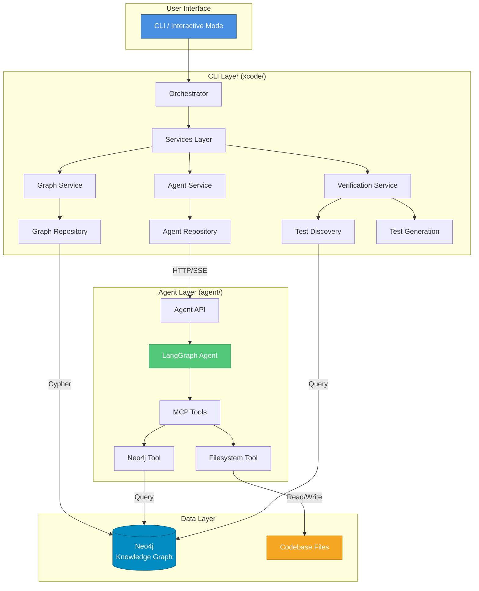

# xCode

> AI-powered coding assistant with codebase knowledge graphs

xCode is an intelligent coding assistant that combines Neo4j knowledge graphs with LangGraph AI agents to understand and modify your codebase. It automatically verifies changes, generates tests, and fixes issues.

## Key Features

- **Knowledge Graph Integration**: Understands your codebase structure via Neo4j
- **AI Agent**: LangGraph-based agent with MCP tools (Neo4j, filesystem)
- **Local LLM Support**: Works with Ollama, LM Studio, or cloud APIs
- **Automatic Verification**: Runs tests/linters after changes, generates missing tests
- **Smart Test Discovery**: Uses Neo4j to find related tests and untested code
- **Auto-Fix Retry**: Agent automatically fixes test failures (configurable attempts)
- **Rich CLI**: Beautiful terminal UI with progress indicators
- **Clean Architecture**: Modular design with clear separation of concerns

## Quick Start

### Docker (Recommended)

```bash
# Configure (single root file for CLI + agent)
cp .env.example .env
# Edit .env and set OPENAI_API_KEY (and any other keys you need)

# Start all services
docker-compose up -d

# Run xCode interactively
docker-compose exec xcode xcode -i

# Or run a single task
docker-compose exec xcode xcode "add type hints to all functions"
```

### Local Development

```bash
# Start backend services
docker-compose up -d neo4j postgres xcode-agent

# Install CLI locally
pip install -e .

# Run xCode
xcode --local "your task here"
```

## CLI Options

```
Options:
  --path, -p PATH          Repository path (default: current directory)
  --language, -l LANG      Language: python or csharp (default: python)
  --project-name NAME      Project name for knowledge graph
  --no-build-graph         Skip building knowledge graph
  --model NAME             LLM model for graph building
  --llm-endpoint URL       Base URL for local LLM API
  --local                  Use local LLM (Ollama at localhost:11434)
  --verbose, -v            Enable verbose output
  --no-verify              Skip automatic verification after changes
  --no-test-generation     Skip automatic test generation for untested code
  --max-fix-attempts N     Maximum retry attempts on test failures (default: 2)
  -i, --interactive        Interactive mode
  --help                   Show this message and exit
```

### Verification Loop

By default, xCode automatically verifies changes after the agent completes a task:

1. **Test Discovery**: Uses Neo4j to find tests related to modified code
2. **Coverage Check**: Identifies untested callables in modified files
3. **Test Generation**: Automatically generates tests for untested code
4. **Verification**: Runs pytest and linters
5. **Auto-Fix**: If tests fail, agent gets 2 attempts to fix issues

Disable with `--no-verify` or `--no-test-generation` flags.

## Repository Structure

```
xcode/
├── xcode/                    # CLI package
│   ├── cli.py               # Click CLI entry point
│   ├── orchestrator.py      # Main orchestrator
│   ├── services/            # Business logic
│   ├── repositories/        # External adapters
│   └── domain/              # Models & interfaces
├── agent/                    # AI Agent (FastAPI + LangGraph)
│   ├── app/
│   │   ├── api/agents/      # Agent API
│   │   ├── engine/          # Agent implementation
│   │   └── core/            # Settings, DB, middleware
│   └── Dockerfile
├── docker-compose.yml       # Full stack orchestration
├── tests/                   # CLI tests
└── pyproject.toml          # CLI dependencies
```

## Architecture

xCode follows a clean architecture with clear separation between the CLI, agent, and data layers:



### Architecture Flow

1. **CLI** receives user tasks and builds knowledge graph
2. **Orchestrator** coordinates services and manages workflow
3. **Agent Service** sends tasks to the agent via HTTP/SSE
4. **LangGraph Agent** uses MCP tools to query Neo4j and modify files
5. **Verification Service** discovers tests, generates missing ones, and runs verification
6. **Auto-Fix Loop** retries with agent if tests fail

## Local LLM (Ollama)

- **Knowledge graph (`xgraph`)**: `xcode --local` (or `XCODE_LLM_ENDPOINT`) normalizes Ollama to an OpenAI-compatible base URL (`http://localhost:11434/v1`) and sets `OPENAI_*` for xgraph while the graph builds. Start Ollama and pull a model (e.g. `ollama pull llama3.2`).
- **Coding agent**: Uses the same **repository root** `.env` as Compose (`LLM_PROVIDER`, `LLM_BASE_URL`, `LLM_MODEL`, `OPENAI_API_KEY`, etc.). For a local OpenAI-compatible server, point `LLM_BASE_URL` at its `/v1` URL and set `LLM_API_KEY` as that server requires.
- **OpenAI-compatible gateway**: `docker compose --profile llm-proxy up -d` runs an optional proxy (default image: LiteLLM; replace with another vendor such as an enterprise gateway). Set `LLM_PROVIDER=openai_proxy`, `LLM_BASE_URL=http://llm-proxy:4000/v1` (or `http://localhost:4000/v1` from the host), `LLM_PROXY_AUTH_KEY`, and `LLM_API_KEY` to the same value the gateway expects for client auth. See `docs/DOCKER.md` and `llm-proxy/config.yaml`.

## Neo4j Knowledge Graph

The agent queries a Neo4j knowledge graph containing:

**Node Types:**
- `Project`, `Folder`, `File`, `Class`, `Callable`, `Test`, `Module`, `Variable`

**Relationship Types:**
- `DECLARED_IN`, `IMPORTS`, `INHERITS_FROM`, `USES`, `TESTS`, `INCLUDED_IN`

**Example Query:**
```cypher
MATCH (f:File)<-[:DECLARED_IN]-(c:Callable)
WHERE NOT EXISTS((c)<-[:TESTS]-())
RETURN c.name, f.path
```

## Development

### Running Tests

```bash
pytest tests/ -v
pytest --cov=xcode --cov-report=html
```

### Code Quality

```bash
black xcode tests
ruff check xcode tests
mypy xcode
```

## Environment Variables

Use **one** file at the repo root: `.env` (see `.env.example`). Docker Compose loads it for the CLI and agent; the agent process also reads `<repo>/.env` directly. Override the path with `XCODE_ENV_FILE` if needed.

```bash
NEO4J_URI=bolt://localhost:7687
NEO4J_USER=neo4j
NEO4J_PASSWORD=password
OPENAI_API_KEY=your-key
LLM_MODEL=gpt-4.1-mini
LA_FACTORIA_URL=http://localhost:8000   # local CLI; compose sets this inside containers
```

## Documentation

- [CLAUDE.md](CLAUDE.md) - Project guide for AI assistants
- [CONTRIBUTING.md](CONTRIBUTING.md) - Development guidelines
- [docs/ARCHITECTURE.md](docs/ARCHITECTURE.md) - Clean architecture details
- [docs/DOCKER.md](docs/DOCKER.md) - Docker setup instructions
- [agent/README.md](agent/README.md) - Agent documentation

### Additional Documentation

- [docs/IMPROVEMENTS.md](docs/IMPROVEMENTS.md) - Improvement suggestions
- [docs/LATENCY_ANALYSIS.md](docs/LATENCY_ANALYSIS.md) - Performance analysis
- [docs/REGRESSION_TEST_REPORT.md](docs/REGRESSION_TEST_REPORT.md) - Test reports

## License

MIT License - see LICENSE file for details
